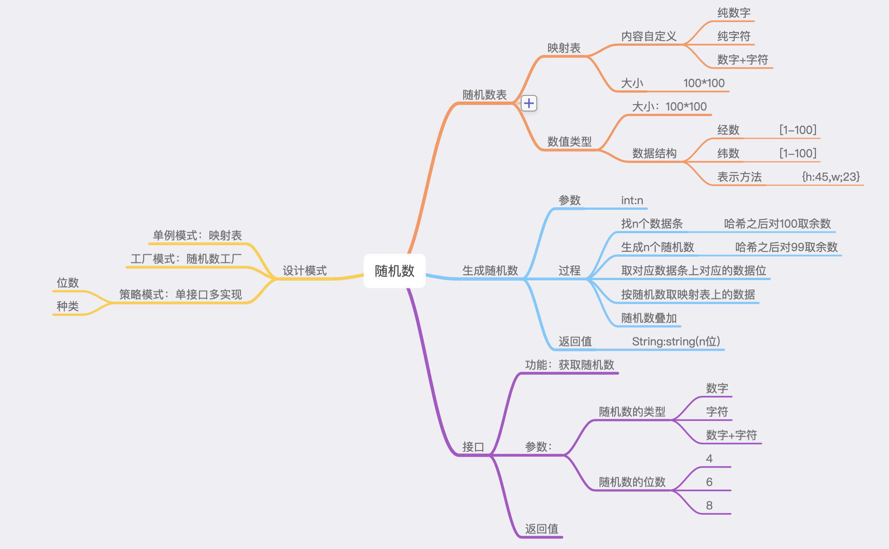

# 随机数的思路

## 看图

## 构建一张100*100的随机数表

|   | 1 | 2 | 3 | 4 | 5 | 6 | 7 | 8 | 9 | 10 |
| --- | --- | --- | --- | --- | --- | --- | --- | --- | --- | --- |
| 1 | * | * | * | * | * | * | * | * | * | * |
| 2 | * | * | * | * | * | * | * | * | * | * |
| 3 | * | * | * | * | * | * | * | * | * | * |
| 4 | * | * | * | * | * | * | * | * | * | * |
| 5 | * | * | * | * | * | * | * | * | * | * |
| 6 | * | * | * | * | * | * | * | * | * | * |
| 7 | * | * | * | * | * | * | * | * | * | * |
| 8 | * | * | * | * | * | * | * | * | * | * |
| 9 | * | * | * | * | * | * | * | * | * | * |
| 10 | * | * | * | * | * | * | * | * | * | * |

 